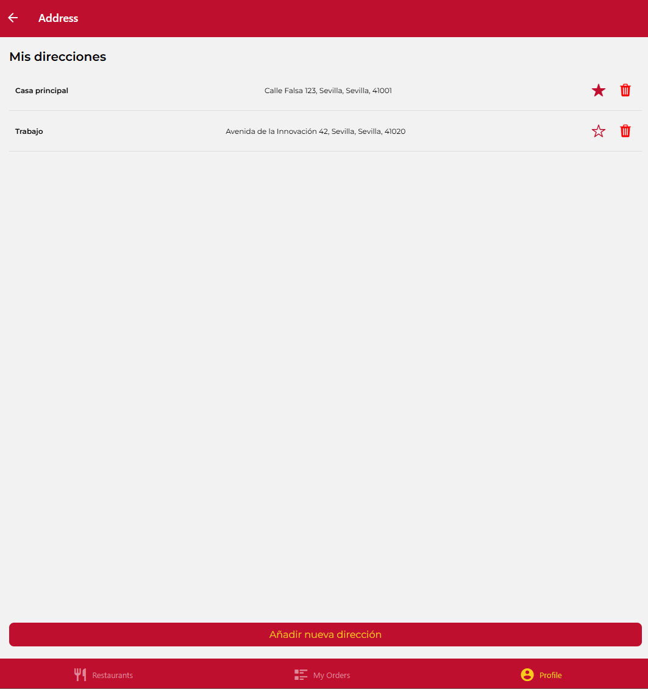
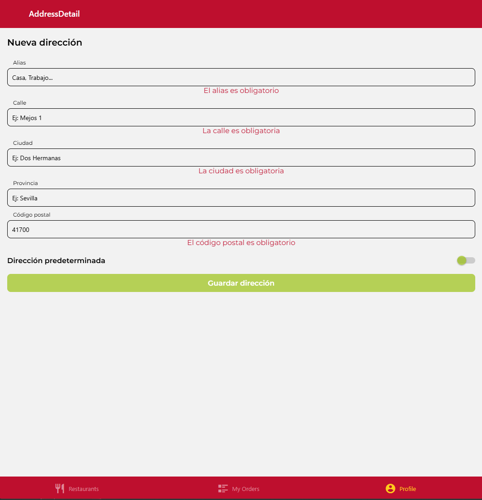

# DeliverUS Exam - Model A - Shipping Address Management - July 2025

Remember DeliverUs is described at: <https://github.com/IISSI2-IS-2025>

## Statement

The goal is to develop a web user interface which allows authenticated customers to **manage their shipping addresses**, using the provided DeliverUS backend API REST.

The development must follow a modular style, just as made during lab sessions.  

## Functional requirements

The following functions must be implemented:

### RF1. List the shipping addresses of an authenticated customer
- Show in the screen all the shipping addresses of current customer (`GET /shippingaddresses`).
- Mark the default shipping address (`isDefault: true`).

It must be followed the design in the figure:



### RF2. Create a new shipping address
- Form to create a new shipping address (`POST /shippingaddresses`) with the following mandatory fields:
  - `alias`, `street`, `city`, `zipCode`, `province`
- If the shipping address is the customer's first one, it must be set automatically as default.



### RF3. Set a shipping address as default
- Button for each shipping address to set it as default (`PATCH /shippingaddresses/:shippingAddressId/default`).
- The screen must be updated to show the new state.

")

### RF4. Delete a shipping address
- Button for each shipping address to delete it (`DELETE /shippingaddresses/:shippingAddressId`).
- A confirmation for deletion must be shown before the delete operation be executed.

")

## Submission Procedure

1. Delete the **DeliverUS-Backend/node_modules**, **DeliverUS-Frontend-Owner/node_modules**, and **DeliverUS-Frontend-Owner/.expo** folders.
1. Create a ZIP file that includes the entire project. **Important: Ensure the ZIP is not the same as the one you downloaded, and includes your solution**.
1. Notify the professor before submission.
1. When the professor approves, upload the ZIP to the Virtual Learning Platform. **It is crucial to wait until the platform shows a link to the ZIP before clicking the submit button**. It is recommended to download the ZIP to check what has been uploaded. Once verified, you may submit the exam.

## Environment Setup

### a) Windows

- Open a terminal and run the following command:

    ```bash
    npm run install:all:win
    ```

### b) Linux/MacOS

- Open a terminal and run the following command:

    ```bash
    npm run install:all:bash
    ```

## Execution

### Backend

- To **recreate the migrations and seeders**, open a terminal and run the following command:

    ```bash
    npm run migrate:backend
    ```

- To **start the backend**, open a terminal and run the following command:

    ```bash
    npm run start:backend
    ```

### Frontend

- To **run the frontend application for the owner**, open a new terminal and run the following command:

    ```bash
    npm run start:frontend
    ```

## Debugging

- To **debug the frontend**, ensure that an instance of the frontend you wish to debug is running, and use the browser's debugging tools.
